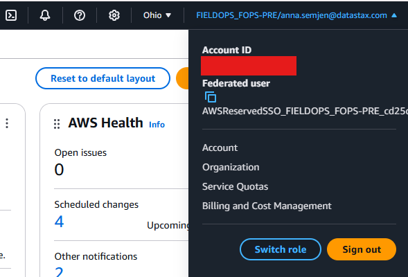

# Provision an EKS cluster and Mission-control from Datastax

## Prerequisites
1. Make sure you have the [AWS CLI](https://aws.amazon.com/cli/) installed on your host machine as well as [kubectl](https://kubernetes.io/docs/tasks/tools/). This is needed to authenticate to AWS. The kubectl is needed to interact with the cluster once it is configured.  
2. After installation configure you sso login to AWS. On My Windows this is under `C:\Users\myusername\.aws` on my Linux `~/.aws`
3. Create a file here - named config
4. Create the default profile
```
[profile default]
sso_start_url = <your_sso_start_url>
sso_region = us-west-2
sso_account_id = 111708290731
sso_role_name = FIELDOPS_FOPS-PRE
```
If you use Okta - you can get the start URL by clicking on AWS SSO - the URL will look something like this `https://d-<sso_id>.awsapps.com/start`
Once signed in you can get the sso_account_id by clicking on your user on the UI in the right corner in AWS. 


5. Once you have the file configured login to authenticate to AWS by typing `aws sso login`
6. Check if kubectl is installed `kubectl --version`
7. Download [terraform](https://developer.hashicorp.com/terraform/install) on your computer. If you are using windows you will need to add the binaries to the `$PATH` manually


## Update the variables file
1. `region` - region where you want your region to be deployed
2. `cluster_name` cluster_name 
3. `loki_bucket` name of your loki bucket
4. `user_email`  this is used to login to the replicated registry
5. `license_id` - download a community license for mission control from the [Datastax website](https://www.datastax.com/products/mission-control/download?_gl=1*zl7p5s*_gcl_aw*R0NMLjE3MzA4ODQ1ODkuQ2p3S0NBaUF4S3k1QmhCYkVpd0FZaVctLTcwRC1qazFSWWJjdkhjbWprRDZTd05kSnc0ZU5FcG9nRUZaVUNEc1MtRTIxUHplWWVDWXVCb0NSZVlRQXZEX0J3RQ..*_gcl_au*MjQ2MTU1NzczLjE3MzE4NjU0NzQuMzc1MTExMTg2LjE3MzMzMTAzODAuMTczMzMxMDM4MA..) and insert your license id here
6. `username` - used to tag resources with
7. `instance_type_db` of the database nodes

## Run the script
`terraform init` - this should download all the relevant modules

Run
`terraform plan >plan1`
This should check the plan and see if it feasible to execute on your machine. It is likely that you run out of the number of VPCs you can create per region - in this case move to another region or submit a support request for AWS to increase the VPC count from 5 to a larger number. 

## Helm installation - non-airgapped environment
In the variables file update the `helm_override_file` parameter you can see an example for an airgapped installation under airgapped.yaml. 


